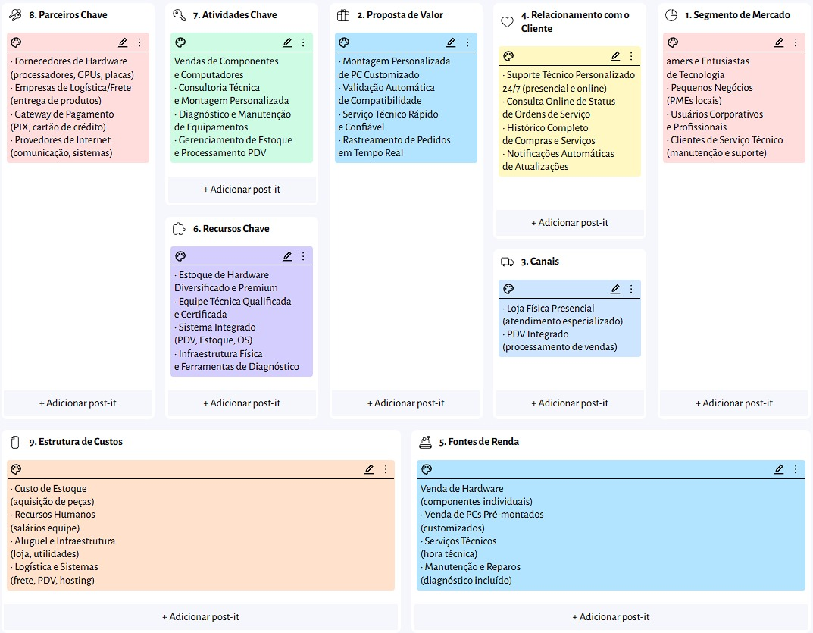

## Canvas

### 1. Proposta de Valor e Segmento de Clientes
O coração da TechForge está em sua **Proposta de Valor**, que foca na *Montagem Personalizada de PCs Customizados* com o diferencial da *Validação Automática de Compatibilidade*, além de oferecer serviços técnicos rápidos e rastreamento de pedidos em tempo real. 

Esse ecossistema foi desenhado para atender a quatro **Segmentos de Mercado** bem definidos:
* Gamers e entusiastas de tecnologia.
* Pequenos negócios e PMEs locais.
* Usuários corporativos e profissionais que demandam hardware de ponta.
* Clientes que necessitam especificamente de serviços técnicos de manutenção e suporte.

### 2. Relacionamento, Canais e Fontes de Renda
A interação com o cliente se dá através de um **Relacionamento** próximo, composto por suporte técnico personalizado 24/7 (presencial e online), consulta online de status de ordens de serviço, notificações automáticas e histórico completo de compras. Os principais **Canais** de entrega dessa experiência são a loja física presencial (com atendimento especializado) e o PDV integrado do sistema.

A viabilidade financeira é garantida por meio de múltiplas **Fontes de Renda**:
* Venda de hardware e componentes individuais.
* Venda de computadores pré-montados e customizados.
* Cobrança por serviços técnicos e hora técnica dedicada.
* Planos de manutenção e reparos com diagnóstico incluído.

### 3. Infraestrutura Operacional (Recursos, Atividades e Parceiros)
Para fazer a máquina girar, o ecossistema conta com **Recursos Chave** vitais, como um estoque de hardware diversificado/premium, uma equipe técnica altamente qualificada, ferramentas de diagnóstico e o sistema integrado (PDV, Estoque e Ordem de Serviço). 

Esses recursos dão suporte às **Atividades Chave** do dia a dia: a venda de componentes, a consultoria técnica para montagem, os diagnósticos de manutenção e o gerenciamento rigoroso do estoque. Toda essa operação é potencializada por **Parceiros Chave** estratégicos, incluindo fornecedores de hardware de marcas líderes (CPUs, GPUs, placas), empresas de logística para fretes ágeis, gateways de pagamento seguros (PIX e cartão) e provedores de infraestrutura de internet e sistemas.

### 4. Estrutura de Custos
Por fim, a **Estrutura de Custos** do projeto mapeia onde os recursos financeiros são alocados para manter a plataforma ativa, dividindo-se entre o custo de aquisição do estoque de peças, os recursos humanos (salários da equipe), os custos fixos de aluguel e infraestrutura física da loja, além dos custos de logística e sistemas (fretes, licenças de PDV e hosting do software).

